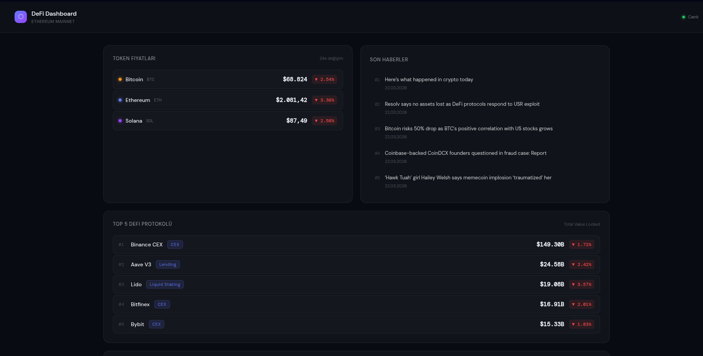

# DeFi Dashboard

## Canlı Demo
https://defi-dashboard-sable.vercel.app

## Ekran Görüntüsü


## Açıklama
Ethereum ekosistemini takip etmek için geliştirilmiş, AI destekli bir Web3 dashboard uygulaması. Canlı piyasa verileri, on-chain sorgular ve yapay zeka destekli piyasa analizi tek bir arayüzde sunulmaktadır.

## Özellikler

- Canlı token fiyatları ve 24 saatlik değişimler (BTC, ETH, SOL)
- Cointelegraph RSS üzerinden son kripto haberleri
- DeFiLlama API ile top 5 DeFi protokolünün TVL verileri
- Alchemy RPC ile Ethereum mainnet üzerinden gerçek zamanlı gas fiyatı ve block bilgisi
- Herhangi bir Ethereum cüzdan adresinin bakiye sorgulaması
- Fiyat, TVL ve haber verilerini birleştiren Claude AI piyasa analizi
- Her 10 dakikada bir AI analizi değişimlere göre güncelleniyor
tam
## Teknolojiler

- Next.js 16 (App Router)
- Anthropic Claude API (claude-haiku-4-5)
- Alchemy Web3 API
- CoinGecko API
- DeFiLlama API
- Cointelegraph RSS

## Kurulum

Repoyu klonla:
```bash
git clone https://github.com/emin255/defi-dashboard.git
cd defi-dashboard
npm install
```

`.env.local` dosyası oluştur:
```
ANTHROPIC_API_KEY=sk-ant-...
ALCHEMY_API_KEY=...
```

Geliştirme sunucusunu başlat:
```bash
npm run dev
```

Tarayıcıda `http://localhost:3000` adresini aç.

## API Kaynakları

| Veri | Kaynak | Kimlik Doğrulama |
|------|--------|-----------------|
| Token fiyatları | CoinGecko | Gerekmez |
| DeFi haberleri | Cointelegraph RSS | Gerekmez |
| TVL verileri | DeFiLlama | Gerekmez |
| On-chain veriler | Alchemy | API key |
| AI analizi | Anthropic | API key |